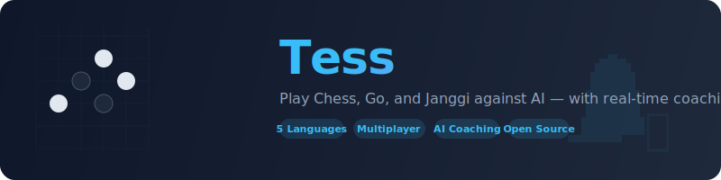

<p align="center">
  
</p>

<p align="center">
  <strong>Play Chess, Go, and Janggi against AI that teaches you as you play.</strong><br>
  Real-time coaching in 5 languages. Multiplayer across the internet. Runs on your machine.
</p>

<p align="center">
  <a href="#quick-start">Quick Start</a> · <a href="#features">Features</a> · <a href="#multiplayer">Multiplayer</a> · <a href="#how-it-works">How It Works</a>
</p>

---

## What Is Tess?

Tess is a board game platform that does something most chess/go apps don't: it **explains why** a move is good or bad, not just which one to play. An AI coach watches your game and gives you feedback after every move — in plain language, in your language.

You pick a difficulty, play your game, and Tess tells you things like:

> **Your queen move** left the d-file undefended. The engine's top suggestion was **Nf3** because it develops a piece while keeping pressure on the center.

After the game, you get a full review: your accuracy percentage, a skill rating, and a narrative summary of what you did well and where to improve.

It works for three games:

- **Chess** — drag-and-drop board, opening recognition, full PGN export
- **Go** — click-to-place stones on 9x9, 13x13, or 19x19 boards
- **Janggi** (Korean Chess) — traditional piece set with palace rules

## Quick Start

```bash
git clone https://github.com/your-repo/tess
cd tess
./tess.sh
```

That's it. The script installs dependencies, downloads game engines, and opens your browser. Takes about 2 minutes on first run.

> **Requirements:** Node.js 20+ (checked automatically). Works on Linux and WSL2. Optional: [Claude Code CLI](https://docs.anthropic.com/en/docs/claude-code) for AI coaching.

## Features

### AI Coaching That Actually Helps

The AI coach (powered by Claude) doesn't just say "Nf3 was better." It explains the position, the threat, and what your move missed. Coaching works during the game and as a post-game review.

Available in **English, Korean, Spanish, Vietnamese, and Mongolian**.

### Five Difficulty Levels

Each game has 5 AI levels calibrated from thousands of simulated games. The AI at "Beginner" makes realistic mistakes. The AI at "Superhuman" plays at engine strength. You can switch difficulty mid-game from the header.

### Your Moves Get Rated

After every game, Tess evaluates your play using the same metrics competitive players use (ACPL — average centipawn loss). You get a skill tier that maps to real-world ratings:

| Tier | Chess | Go | Janggi |
|------|-------|----|--------|
| Superhuman | 2800+ Elo | 9 dan+ | 2800+ Elo |
| Pro | 2200-2500 | 1-3 dan | 2200-2500 |
| Club | 1600-1800 | 4-8 kyu | 1600-1800 |
| Casual | 1200-1400 | 13-15 kyu | 1200-1400 |
| Beginner | Under 1200 | 16+ kyu | Under 1200 |

The scale is the same across all three games, so your "Club" rating means the same thing in chess as in Go.

### Engine Suggestions

See the top engine moves with eval scores while you play. Adjustable depth (Fast / Balanced / Deep). Hover a suggestion to see the arrow on the board. Click to play it.

### Game Review

After the game ends, you get:
- **Accuracy percentage** and **skill rating**
- **Move-by-move quality** (Best, Good, Inaccuracy, Mistake, Blunder)
- **AI narrative summary** — a paragraph about your strengths and mistakes
- **Board replay** for chess with arrow-key navigation

### Themes

Three visual themes: **Midnight** (dark blue), **Forest** (green), **Sandstorm** (warm).

## Multiplayer

Play against friends — on the same machine, over WiFi, or across the internet.

### Local Play

Open two browser tabs. One creates a challenge in the Multiplayer lobby, the other accepts with the 6-character game code. Fischer clocks included. Untimed games have a 2-minute idle timer so nobody stalls.

### Play Over the Internet

Tess instances **find each other automatically** using a peer-to-peer discovery network. No port forwarding needed — it punches through most home routers.

When another Tess server is running somewhere in the world, their challenges show up in your lobby tagged with their server name. Click "Play" and the game starts — moves, emojis, and chat messages relay over an encrypted connection between the two servers.

You can also play manually: share your IP or use a tunnel (Tailscale, Cloudflare Tunnel), and your friend opens it in their browser.

### In-Game Chat

Send emoji reactions (👍 👏 😅 🤔 ⚡ 🤝) and preset messages during multiplayer games. Messages are translated into each player's language automatically.

### Privacy

- Toggle "Network Play" off in the lobby to stop all federation
- Your games and stats never leave your machine
- No accounts — you're identified by a random bird name (Falcon4821)
- Set `TESS_DISCOVERY_TOPIC=secret-phrase` for a friends-only discovery group

## How It Works

Tess runs on your machine as a local web server. You open it in your browser like any website.

```
Your Browser ←→ Tess Server (localhost:8082) ←→ Game Engines (Fairy-Stockfish, KataGo)
                     │
                     ├── AI Coaching (Claude CLI)
                     ├── Game Database (SQLite)
                     └── Federation (Hyperswarm P2P)
```

Game engines run as background processes. The server manages games, validates moves, and coordinates multiplayer. Everything stays local — nothing is sent to the cloud.

For multiplayer across the internet, Tess uses three discovery layers:

1. **Hyperswarm** — finds other Tess servers via the BitTorrent DHT network, then establishes encrypted connections through NAT
2. **UPnP** — automatically opens your server port on the router (~85% of home routers)
3. **mDNS** — instant discovery on the same WiFi/LAN

All game traffic between servers is encrypted with the Noise protocol (same as WireGuard).

---

## Installation Details

### What Gets Installed

| Component | Size | Source |
|-----------|------|--------|
| Node.js packages | ~100MB | npm registry |
| Fairy-Stockfish (chess/janggi) | ~1MB | GitHub releases |
| KataGo + neural network (go) | ~130MB | GitHub releases |
| Sound effects | ~5KB | Generated locally |

Engines are downloaded automatically by `./tess.sh`. If auto-download fails (wrong architecture, network issues), the script prints manual download instructions with direct links.

```bash
./scripts/download-engines.sh          # Re-download all engines
./scripts/download-engines.sh --help   # See options
```

### Configuration

```bash
# .env (optional — defaults work for most users)
PORT=8082                    # Server port
TESS_DISCOVERY=off           # Disable federation
TESS_SERVER_NAME=MyTess      # Name shown to other servers
TESS_DISCOVERY_TOPIC=secret  # Private discovery group
ENGINE_POOL_SIZE=4           # More engine workers for more concurrent games
```

### Commands

```bash
./tess.sh              # Install + launch (first time)
./tess.sh dev          # Development mode with hot reload
./tess.sh prod         # Production mode
./tess.sh status       # Server health, engine status, federation stats
./tess.sh stop         # Stop everything
```

## Security

- **Server-authoritative** — all moves validated server-side, clients cannot cheat
- **Encrypted federation** — Noise protocol on all cross-server traffic
- **No direct connections** — players connect to their own server, never to each other
- **Input validation** — all WebSocket messages validated via Zod schemas, all federation data size-limited and type-checked
- **Rate limiting** — 30 WS messages/sec per client, 10 federation requests/min per IP
- **Whitelist communication** — only preset emojis and message keys can be sent between players

See [docs/FEDERATION.md](docs/FEDERATION.md) for the full security model.

## For Developers

### Architecture

```
packages/shared/   — Game logic (IGame interface), protocol, evaluation
packages/client/   — Svelte 5 SPA, Tailwind v4, board components
packages/server/   — Hono HTTP, WebSocket, GameEngine, AI, federation, SQLite
```

Games are modular via the `IGame` interface. Adding a new game (xiangqi, shogi, etc.) means implementing `IGame` + `GameEngine` — zero changes to game rooms, multiplayer, or evaluation.

### API

```
GET  /api/health                — Server status + federation stats
GET  /api/games                 — Game history (filterable)
GET  /api/games/:id/export      — PGN/SGF download
GET  /api/users/:id/stats       — Player stats (W/L/D, accuracy)
GET  /api/federation/status     — Discovery status + peer count
```

### Testing

```bash
pnpm --filter shared test                      # 56 game logic + evaluation tests
pnpm biome check .                             # Lint + format
node test-mp-autoplay.cjs chess 800 2200       # Autoplay simulation
node test-mp-autoplay.cjs go 1200 2200         # Go simulation
node test-mp-autoplay.cjs janggi 1200 2200     # Janggi simulation
```

### Documentation

- [Engine Calibration](docs/engine-calibration.md) — How AI difficulty and skill evaluation work
- [Federation](docs/FEDERATION.md) — P2P discovery, protocol, security model
- [Engines](docs/ENGINES.md) — Engine setup, difficulty mapping, troubleshooting

## License

MIT
